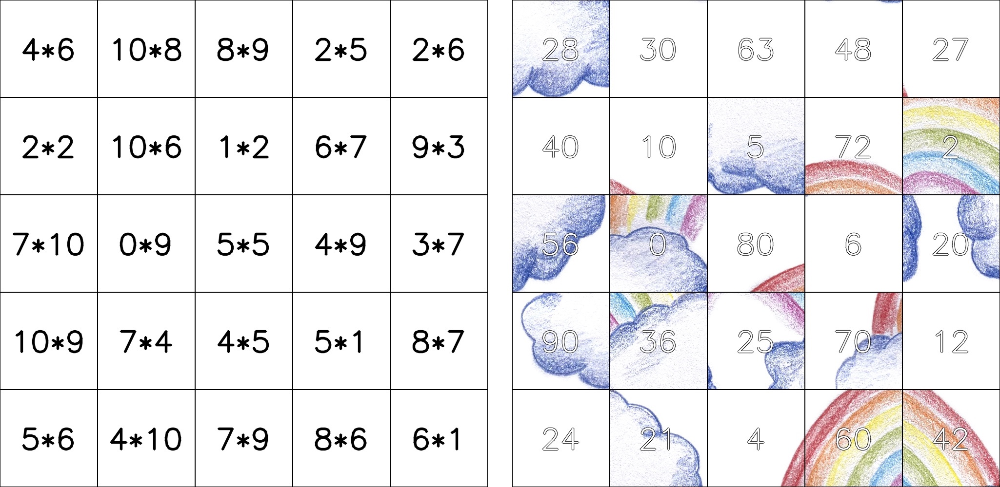
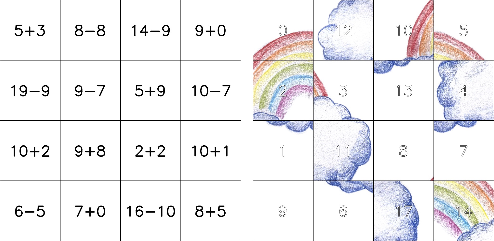

# math_puzzle
Create math puzzles from images

## Usage
```
% python puzzle.py -h
usage: puzzle.py [-h] [-o OUTFILE] [-s] [--noscale] [--width WIDTH] [--height HEIGHT] [--hdist HDIST] [--rotate] [--multi] [--multimaxfactor MULTIMAXFACTOR]
                 [--multiminfactor MULTIMINFACTOR] [--multimaxresult MULTIMAXRESULT] [--multiminresult MULTIMINRESULT] [--plus] [--minus]
                 [--plusmaxsummand PLUSMAXSUMMAND] [--plusminsummand PLUSMINSUMMAND] [--plusmaxresult PLUSMAXRESULT] [--plusminresult PLUSMINRESULT] [--custom CUSTOM]
                 [--custom_questions CUSTOM_QUESTIONS]
                 file rows cols

This script creates math (or vocabulary, etc.) puzzles from images.

positional arguments:
  file                  path to input image file
  rows                  number of puzzle rows
  cols                  number of puzzle columns

options:
  -h, --help            show this help message and exit
  -o OUTFILE, --outfile OUTFILE
                        output file name
  -s, --split           split into two files
  --noscale             don't scale image, keep original size
  --width WIDTH         width of final image
  --height HEIGHT       height of final image
  --hdist HDIST         distance between grid and puzzle
  --rotate              rotate image and place side by side (instead of on top of each other)
  --multi               use multiplication exercises
  --multimaxfactor MULTIMAXFACTOR
                        maximal factor in multiplication exercises
  --multiminfactor MULTIMINFACTOR
                        minimal factor in multiplication exercises
  --multimaxresult MULTIMAXRESULT
                        maximal result in multiplication exercises
  --multiminresult MULTIMINRESULT
                        minimal result in multiplication exercises
  --plus                use plus exercises
  --minus               use minus exercises
  --plusmaxsummand PLUSMAXSUMMAND
                        maximal summand in addition exercises
  --plusminsummand PLUSMINSUMMAND
                        minimal summand in addition exercises
  --plusmaxresult PLUSMAXRESULT
                        maximal result in addition exercises
  --plusminresult PLUSMINRESULT
                        minimal result in addition exercises
  --custom CUSTOM       file (xslx or csv) containing custom exercises
  --custom_questions CUSTOM_QUESTIONS
                        what column should be used as questions; 0 (default): both at random, 1: first col, 2: second col
```

## Examples

Create a 5x5 puzzle, by default it uses multiplication exercises, 0x0 up to 10x10:
```
python puzzle.py images/regenbogen.jpg 5 5
```


Create a 4x4 puzzle with plus and minus exercises 0+0 up to 10+10:
```
python puzzle.py images/regenbogen.jpg 4 4 --plus --minus
```


Create 8x5 puzzle with both multiplication and addition. Use white borders in the image and place the image and grid side by side:
```
python puzzle.py images/farben_leuchten_schwarz.jpg 8 5 --bordercol=255,255,255 --rotate --plus --minus --multi --plusmaxresult 100 --plusmaxsummand 100 --width 1500
```

